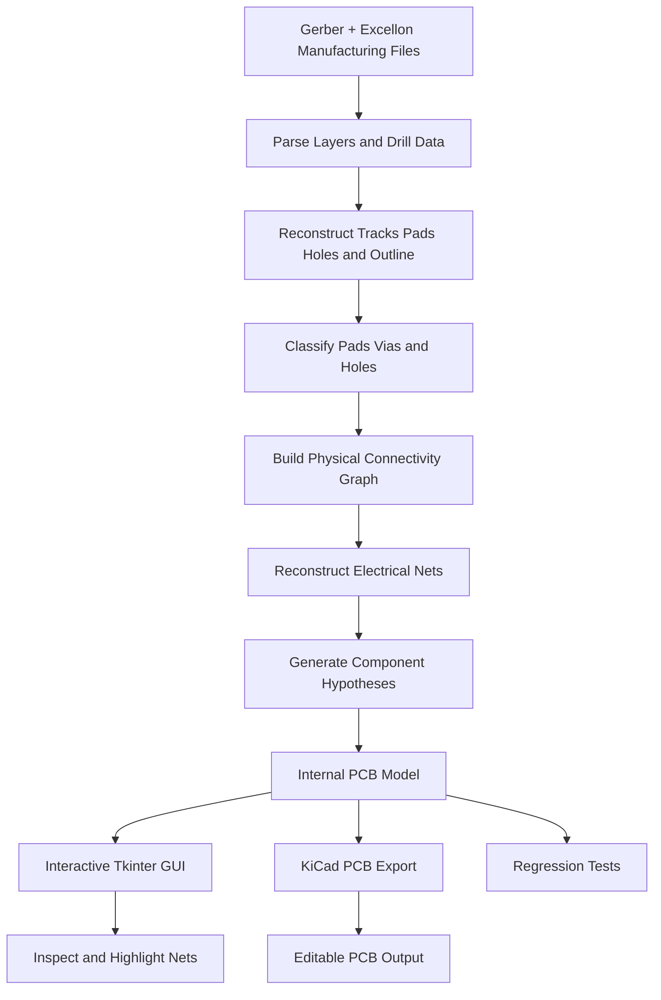

# PHOTONX EDA PCB

A working **PCB reverse-engineering MVP** that demonstrates the flow:

**Gerber / Excellon → geometry → pad/hole classification → physical connectivity graph → reconstructed nets → component hypotheses → interactive GUI → KiCad export → regression tests.**



> This is an engineering MVP, not a replacement for a production CAM/EDA parser. The Gerber parser intentionally supports a useful subset (aperture definitions, aperture selection, D01/D02/D03, common FS coordinates). Component recognition is explicitly probabilistic.

## Architecture

```text
Manufacturing files
      |
      v
Gerber + Excellon parsers
      |
      v
Structured geometry
(tracks / pads / holes / outline)
      |
      v
Drill attachment + object classification
      |
      v
Physical connectivity graph
      |
      v
Connected components => reconstructed nets
      |
      +--> component hypotheses + confidence/evidence
      |
      +--> Tkinter PCB viewer / net highlighting / inspector
      |
      +--> KiCad .kicad_pcb export
      v
Regression tests
```

## Included example

`examples/PHOTONX_LED_TEST/input/` contains a small manufactured-data-style board with six flashed pads, four copper traces, six drills and a 50×30 mm outline. The pipeline reconstructs three electrical islands/nets and three 2-pin component hypotheses.

## Install

```bash
python -m venv .venv
# Windows
.venv\Scripts\activate
pip install -e .[test]
```

## Run tests

```bash
pytest -q
```

## Reverse the included example

```bash
photonx examples/PHOTONX_LED_TEST/input \
  --json examples/PHOTONX_LED_TEST/output/reconstructed.json \
  --kicad examples/PHOTONX_LED_TEST/output/PHOTONX_LED_TEST.kicad_pcb
```

## Open GUI

```bash
photonx examples/PHOTONX_LED_TEST/input --gui
```

The GUI shows the board outline, copper tracks and pads. Selecting a net highlights its connected copper. Clicking a pad/track shows its reconstructed object data.

## What is reconstructed vs. inferred?

**Directly parsed:** geometry, aperture width/diameter, drill coordinates/diameters, board outline.

**Reconstructed from physical evidence:** electrical islands/nets based on copper intersection/touching.

**Hypothesized:** component groupings/types. Each hypothesis stores confidence and evidence; it is not presented as ground truth.

## Current limitations

- Single copper layer in the MVP connectivity engine.
- Limited RS-274X subset; no regions, step-repeat, polarity handling or macro apertures yet.
- Simple Excellon subset.
- No schematic recovery.
- Component recognition is currently a geometric 2-pad heuristic.
- KiCad output is generated but not validated by `kicad-cli` unless KiCad is installed separately.

## Next production steps

Add full Gerber X2 attributes, multi-layer plated-via connectivity, zones/regions, spatial indexing, footprint pattern library, silkscreen/OCR-assisted reference recognition, confidence heatmaps, DRC/ERC, BOM/image evidence fusion, and KiCad round-trip validation.
