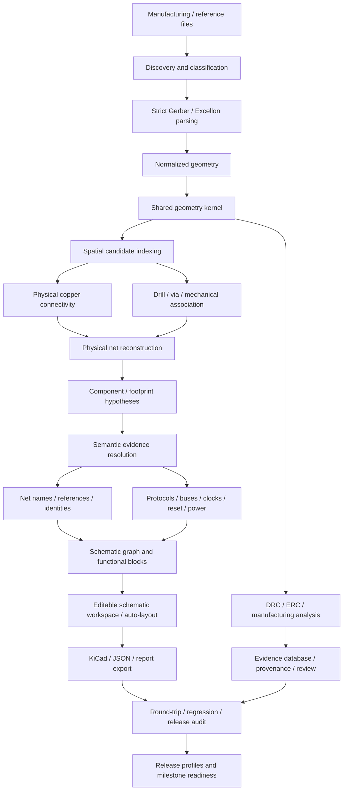

# PHOTONX EDA PCB

PHOTONX is an **evidence-driven PCB manufacturing-data reconstruction and reverse-engineering platform**.

It is designed to recover defensible physical structure, connectivity, manufacturing evidence, and higher-level engineering hypotheses from PCB manufacturing data without pretending that lost design intent is magically known.

> **Core rule:** unknown stays unknown.  
> PHOTONX preserves provenance, confidence, assumptions, conflicts, and unresolved state instead of replacing missing information with plausible-looking guesses.

## Project status

- Package version: **0.2.0**
- Python: **3.11+**
- Main dependencies: **NetworkX** and **Shapely**
- Latest green CI at this README update: **615 tests passed** on Python **3.11, 3.12, and 3.13**
- Development state: active engineering platform with strict parser boundaries, evidence tracking, reconstruction, analysis, GUI/schematic tooling, regression infrastructure, release governance, and milestone-readiness checks

PHOTONX is **not** a complete CAM replacement, electrical sign-off tool, or fabrication guarantee.

---

## What PHOTONX is trying to solve

PCB manufacturing data often preserves geometry much better than design intent.

Gerber, Excellon, fabrication artifacts, BOMs, pick-and-place files, IPC-style net evidence, and reconstructed geometry can reveal a great deal, but they do not automatically prove the original:

- schematic hierarchy,
- semantic net names,
- component references,
- values or part numbers,
- firmware configuration,
- stack-up material,
- design-rule intent,
- electrical function,
- or engineering rationale.

PHOTONX therefore treats reverse engineering as an **evidence pipeline**, not as image-to-BOM magic.

---

## Reconstruction flow



---

## Current capability summary

### Parsing

| Capability | Current status | Notes |
|---|---|---|
| Gerber linear draws and flashes | **Implemented subset** | Strict RS-274X subset with provenance |
| Gerber C/R/O apertures | **Implemented** | Used by the production geometry path |
| Gerber arcs / regions / macros | **Not implemented in the production high-level parser** | Unsupported constructs are rejected or diagnosed instead of silently approximated |
| Excellon point drill hits | **Implemented** | Metric/inch tools and drill hits |
| Excellon G85 straight slots | **Implemented** | Explicit straight canned-slot reconstruction |
| Excellon linear routing | **Partial** | G00/M15/G01/M16 linear routed paths are reconstructed |
| Excellon routed arcs | **Not implemented** | G02/G03 routed arcs remain unsupported |
| Strict/permissive parser modes | **Implemented** | Strict mode fails on unsupported syntax; permissive mode records diagnostics |
| Parser conformance harness | **Implemented** | Executable support-boundary regression cases |

### Geometry and physical reconstruction

- shared geometry kernel for tracks and reconstructed C/R/O pads;
- deterministic coordinate/tolerance handling;
- board-material reconstruction from closed outlines and cutouts;
- spatial candidate indexing for geometry-heavy operations;
- same-layer physical copper connectivity;
- drill-to-pad association;
- via-span evidence and multilayer reasoning;
- copper-zone contact analysis;
- exact annular-ring checks;
- drill-to-copper clearance checks;
- board-edge and cutout-aware clearance checks;
- mechanical slot/hole geometry and clearance analysis;
- deterministic physical-net grouping.

Spatial indexing is used to reduce candidate pairs; **exact Shapely/Euclidean predicates remain authoritative**.

### Component and semantic reconstruction

PHOTONX can build and cross-check evidence for:

- component and footprint hypotheses;
- reference-designator recovery;
- values, footprints, MPN candidates, and component identity;
- BOM and pick-and-place reconciliation;
- board variants and DNP handling;
- net-name evidence;
- bus grouping;
- clock and reset candidates;
- signal-role synthesis;
- differential-pair candidates;
- serial interfaces such as I2C, SPI, UART, and CAN;
- connector pin-function hypotheses;
- MCU / SoC peripheral mapping;
- FPGA bank evidence;
- SWD / JTAG debug-interface candidates;
- DDR-style topology candidates;
- repeated-circuit and functional-block analysis;
- analog, power, protection, termination, bias, and conditioning hypotheses.

These are **evidence-backed hypotheses**, not automatically recovered original design intent.

### Engineering analysis

The repository contains engineering-analysis layers for areas such as:

- DRC and ERC;
- copper width and clearance;
- annular ring;
- drill and mechanical clearance;
- edge/cutout clearance;
- return-path evidence;
- power-tree and supply-domain reconstruction;
- decoupling quality;
- current-capacity evidence;
- thermal-risk prioritization;
- signal-integrity risk;
- fabrication-yield risk;
- assembly manufacturability;
- test-point and testability analysis;
- length groups and generated candidate constraints;
- net-class generation.

Risk scores and synthesized constraints are review aids. They are **not substitutes for dedicated SI/PI, thermal, safety, or manufacturer DFM tools**.

---

## Schematic reconstruction and editing

PHOTONX includes infrastructure for:

- schematic graph generation;
- functional-block clustering;
- generated schematic pages;
- editable schematic state;
- staged edits and human-review routing;
- deterministic auto-layout;
- page partitioning;
- wire routing;
- undo/redo and command-bus integration;
- confidence / provenance-aware editing workflows;
- structured KiCad schematic export;
- deterministic export snapshots;
- schematic round-trip checks.

Generated schematic hierarchy and layout are **review-oriented reconstructions**, not claims that the original design used the same page structure.

---

## Evidence, provenance, and governance

Evidence handling is a first-class part of PHOTONX.

The repository includes systems for:

- source and line provenance;
- evidence records and confidence;
- semantic conflicts;
- unresolved-state tracking;
- review queues and checkpoints;
- annotations;
- source-change tracking;
- deterministic replay;
- invalidation auditing;
- fault injection;
- regression baselines;
- ground-truth matrices;
- benchmark governance;
- release manifests;
- change control and ECO tracking;
- compatibility freeze checks;
- release-candidate assembly;
- manufacturing-package audit;
- production-board validation;
- Development / Research / Review / Manufacturing-export-candidate release profiles;
- milestone-readiness aggregation.

### Phase-70 readiness

The current repository includes a Phase-70 readiness layer that aggregates release, manufacturing, change-control, compatibility, replay, benchmark, semantic, traceability, and round-trip evidence.

A Phase-70 pass is an **internal software/evidence milestone only**.

It is **not**:

- electrical certification,
- safety certification,
- regulatory approval,
- fabrication approval,
- or proof that unknown original design intent has been recovered.

See [docs/PHASE70_READINESS.md](docs/PHASE70_READINESS.md).

---

## Repository map

The codebase is intentionally modular. Major areas include:

```text
src/photonx_eda_pcb/
├── parsers/                     # Gerber / Excellon parsing and diagnostics
├── geometry/                    # Geometry helpers
├── geometry_kernel/             # Shared exact geometry representation
├── spatial/                     # Spatial utilities
├── spatial_connectivity/        # Candidate indexing
├── connectivity/                # Copper graph / drill association / physical nets
├── stackup/                     # Stack-up evidence
├── via_span/                    # Via-span candidates and validation
├── zones/                       # Copper-zone analysis
├── footprints/                  # Footprint inference
├── inference/                   # Component hypotheses
├── component_identity/          # Identity resolution
├── net_naming/                  # Semantic net evidence
├── schematic_graph/             # Reconstructed schematic topology
├── functional_blocks/           # Functional clustering
├── schematic_editor/            # Editable schematic model
├── schematic_autolayout/        # Deterministic layout
├── kicad_schematic_export/      # Structured schematic export
├── drc/                         # Design-rule checks
├── erc/                         # Electrical-rule checks
├── production_board_validation/ # Production-readiness checks
├── evidence_database/           # Evidence storage
├── review_workflow/             # Human-review routing
├── regression_corpus/           # Regression datasets / expectations
├── performance_profiles/        # Runtime evidence
├── memory_metrics/              # Memory measurements
├── incremental_pipeline/        # Cached recomputation
├── quality_gate/                # Base quality gates
├── production_release_profiles/ # Release profiles
├── release_candidate/           # Release assembly
├── milestone_readiness/         # Phase-70 readiness
├── exporters/                   # JSON / KiCad board export
├── gui/                         # Tkinter viewer
└── ...
```

The repository contains many additional domain packages. This map is intentionally thematic rather than exhaustive.

---

## Quick start

### Install

```bash
python -m pip install -e ".[test]"
```

### Run the test suite

```bash
pytest -q
```

The GitHub CI matrix currently runs the suite on:

- Python 3.11
- Python 3.12
- Python 3.13

At the time of this README update, all three environments passed with:

```text
615 passed, 2 warnings
```

### Inspect declared production parser capabilities

```bash
photonx capabilities
```

### Reconstruct a manufacturing-data directory

```bash
photonx reconstruct examples/PHOTONX_LED_TEST/input --output build/led
```

Use permissive parser mode only when you intentionally want unsupported constructs recorded as diagnostics:

```bash
photonx reconstruct examples/PHOTONX_LED_TEST/input \
  --output build/led \
  --permissive
```

### Emit the experimental KiCad PCB reconstruction

```bash
photonx reconstruct examples/PHOTONX_LED_TEST/input \
  --output build/led \
  --kicad
```

If `kicad-cli` is unavailable, PHOTONX records that fact. It does not claim native KiCad validation occurred.

### Launch the model-backed GUI

```bash
photonx gui examples/PHOTONX_LED_TEST/input
```

---

## Synthetic data and ground truth

The repository contains many synthetic fixtures and regression corpora.

Synthetic datasets are intentionally labeled as synthetic. They are used to test:

- parser support boundaries;
- geometry;
- connectivity;
- drill/via association;
- DRC/ERC;
- schematic reconstruction;
- semantic inference;
- spatial parity;
- deterministic replay;
- release and readiness logic.

Synthetic fixtures are **not** presented as recovered production boards.

External/reference datasets should carry source, license, checksum, and admission metadata before being treated as ground-truth evidence.

---

## Interpretation rules

PHOTONX deliberately distinguishes between what is **observed**, **derived**, **inferred**, and **unknown**.

Examples:

- a connected copper island is a **physical net**, not automatically the original schematic net;
- a geometric component match is a **hypothesis**, not automatically a BOM identity;
- a likely clock or reset is a **candidate**, not proof of firmware behavior;
- a generated net class is a **reconstructed engineering recommendation**, not the original design rule;
- an inferred schematic page is a **review view**, not proof of original hierarchy;
- unknown drill plating remains **unknown** until evidence proves otherwise;
- a quality/readiness pass is a **software/evidence gate**, not electrical or fabrication certification.

---

## Known limitations

Important current limitations include:

- the production high-level Gerber parser still does not support the full Gerber language;
- Gerber arcs, regions, and aperture macros remain outside the declared production subset;
- Excellon routed arcs remain unsupported;
- some low-level syntax helpers recognize constructs that the high-level reconstruction path intentionally does not yet claim to support;
- original semantic net names are generally not recoverable from manufacturing geometry alone;
- exact component identity may remain unresolved without BOM, marking, or external evidence;
- material stack-up and dielectric properties cannot be assumed from copper geometry;
- generated schematic hierarchy and design constraints require review;
- dedicated electrical, SI/PI, thermal, safety, EMC, and manufacturer sign-off remain outside PHOTONX's authority.

See [docs/LIMITATIONS.md](docs/LIMITATIONS.md) and the relevant domain documentation before treating outputs as production evidence.

---

## Recommended documentation

Start with:

- [Architecture](docs/ARCHITECTURE.md)
- [Current limitations](docs/LIMITATIONS.md)
- [Phase 59–70 roadmap](docs/CODING_ROADMAP_PHASE59_70.md)
- [Phase-70 readiness](docs/PHASE70_READINESS.md)
- [Production release profiles](docs/PRODUCTION_RELEASE_PROFILES.md)
- [Parser conformance suite](docs/PARSER_CONFORMANCE_SUITE.md)
- [Spatial integration](docs/SPATIAL_INTEGRATION.md)
- [Geometry kernel](docs/GEOMETRY_KERNEL.md)
- [Production-board validation](docs/PRODUCTION_BOARD_VALIDATION.md)
- [KiCad schematic export](docs/KICAD_SCHEMATIC_EXPORT.md)
- [Project health](docs/PROJECT_HEALTH.md)

---

## Primary format references

PHOTONX development is intended to remain grounded in authoritative format documentation.

- Ucamco Gerber format/specification and conformance resources  
  https://www.ucamco.com/en/guest/downloads/gerber-format
- Ucamco Gerber reference information  
  https://www.ucamco.com/en/gerber
- KiCad PCB S-expression format  
  https://dev-docs.kicad.org/en/file-formats/sexpr-pcb/
- KiCad S-expression syntax  
  https://dev-docs.kicad.org/en/file-formats/sexpr-intro/index.html

---

## Engineering philosophy

PHOTONX favors:

- strict parsing over silent acceptance;
- deterministic output over accidental ordering;
- evidence over guesses;
- confidence and provenance over fake certainty;
- parity tests before replacing reference algorithms;
- synthetic regression fixtures over unverified anecdotes;
- explicit unsupported states over partial hidden behavior;
- compatibility bridges over abrupt API breakage;
- reproducible release evidence over informal “looks good” sign-off.

The project remains under active development. The goal is not to declare reverse engineering “finished,” but to make every reconstructed claim progressively more **auditable, reproducible, testable, and defensible**.
