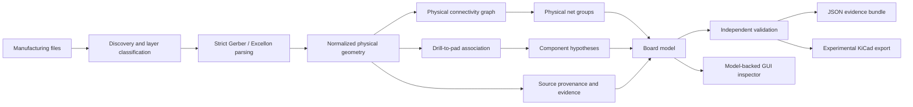

# PHOTONX EDA PCB

PHOTONX is an **evidence-driven PCB manufacturing-data reconstruction toolkit**. The project is being built to recover defensible physical structure from Gerber/Excellon data without pretending that lost schematic semantics are magically known.

> Current version: **0.2.0 engineering scaffold**. It is intentionally strict and incomplete rather than permissive and misleading.

## What changed from the first demo

The first repository version was a small proof of concept. This rebuild removes the biggest sources of false confidence:

- unsupported Gerber/Excellon statements are no longer silently ignored;
- drill plating is `unknown` unless evidence proves it;
- connected copper islands are called **physical nets**, not original schematic nets;
- inferred parts are **component hypotheses**, not fake BOM entries;
- every parsed physical object preserves source file/line provenance;
- deterministic IDs make repeated runs auditable and diffable;
- validation is independent from reconstruction and includes fault-injection tests;
- KiCad validation is reported only if `kicad-cli` actually runs.

## Reverse-engineering flow



## Repository structure

```text
src/photonx_eda_pcb/
├── capabilities.py
├── config.py
├── errors.py
├── ids.py
├── models.py
├── provenance.py
├── pipeline.py
├── validation.py
├── reporting.py
├── units.py
├── parsers/
├── connectivity/
├── inference/
├── exporters/
├── io/
└── gui/
```

## Capability matrix

| Capability | Status | Meaning |
|---|---|---|
| Gerber C/R/O flashes and linear draws | Implemented subset | Parsed strictly with provenance |
| Gerber arcs, regions, macros, SR/AB | Not implemented | Rejected or diagnosed; never silently approximated |
| Excellon point drill hits | Implemented subset | Metric/inch tool definitions and drill hits |
| Excellon routes/slots | Not implemented | Rejected rather than faked |
| Same-layer copper connectivity | Implemented | Geometry touch/overlap graph |
| Original logical net names | Not inferable from geometry alone | PHOTONX does not invent them |
| Component identification | Hypothesis only | Confidence + evidence retained |
| JSON evidence bundle | Implemented | Auditable reconstruction output |
| KiCad board export | Experimental | External `kicad-cli` validation when available |
| GUI inspection | Implemented basic viewer | Operates on the actual BoardModel |

## Run

```bash
python -m pip install -e ".[test]"
pytest -q
```

```bash
photonx reconstruct examples/PHOTONX_LED_TEST/input --output build/led --kicad
photonx capabilities
photonx gui examples/PHOTONX_LED_TEST/input
```

## Current regression evidence

The 0.2.0 rebuild currently passes **17 tests** covering units, strict parser behavior, Excellon parsing, file discovery, deterministic connectivity, component-hypothesis semantics, validation fault injection, JSON provenance and KiCad export structure.

The included LED dataset is explicitly marked **synthetic test data**. It is not presented as a recovered real production board.

## Primary format references

- Ucamco Gerber format/specification and conformance files: https://www.ucamco.com/en/guest/downloads/gerber-format
- Ucamco Gerber reference information: https://www.ucamco.com/en/gerber
- KiCad board file format: https://dev-docs.kicad.org/en/file-formats/sexpr-pcb/
- KiCad S-expression syntax: https://dev-docs.kicad.org/en/file-formats/sexpr-intro/index.html

See `docs/LIMITATIONS.md` before treating output as production CAM data.
