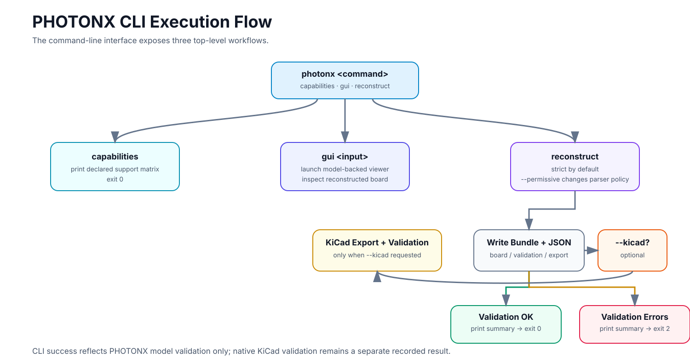
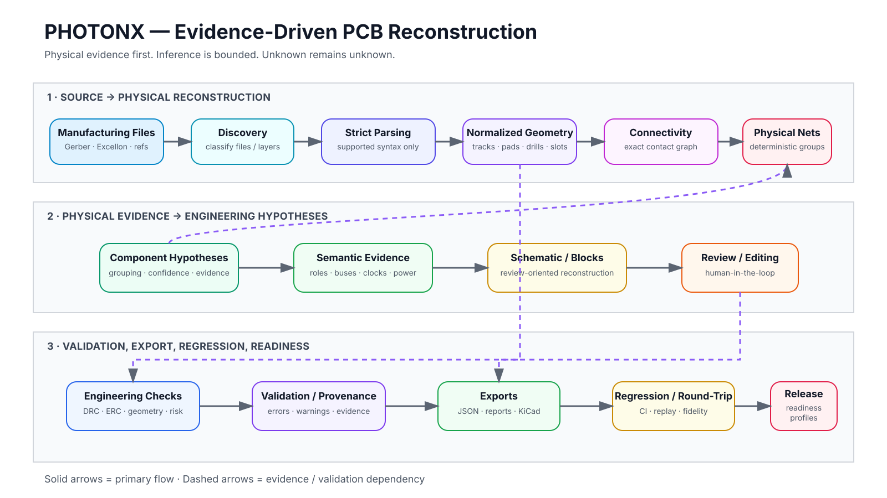
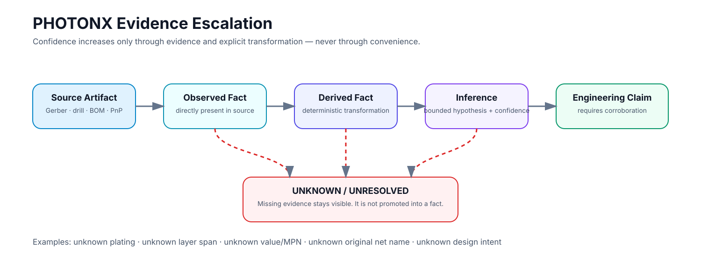
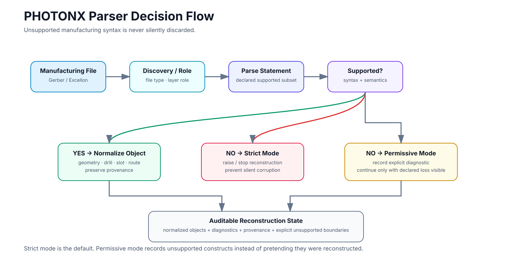
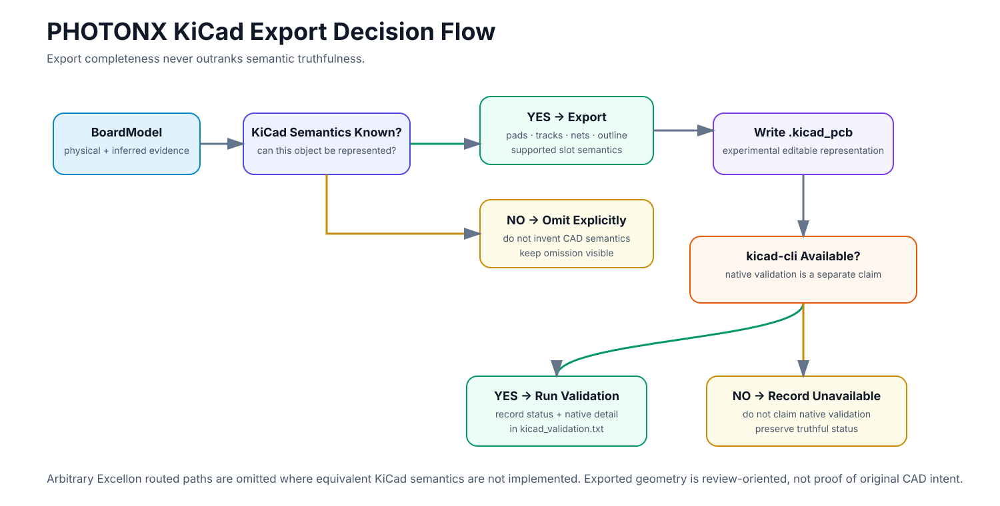
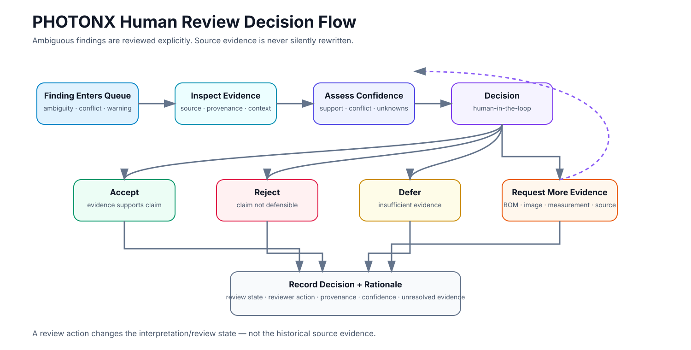
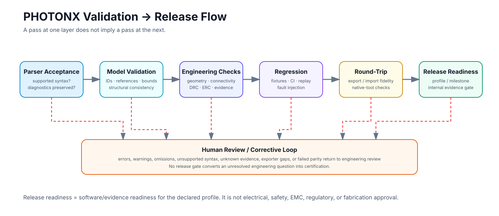

# PHOTONX EDA PCB

[](https://github.com/3more102/PHOTONX_EDA_PCB/actions/workflows/tests.yml)


[](docs/ARCHITECTURE.md)
[](CONTRIBUTING.md)
[](CHANGELOG.md)

**Evidence-driven PCB manufacturing-data reconstruction and reverse engineering.**

PHOTONX converts PCB manufacturing evidence into an auditable engineering model: geometry, drills and slots, physical connectivity, reconstructed nets, component and semantic hypotheses, validation evidence, review artifacts, and experimental KiCad output.

> **Core rule: unknown stays unknown.**  
> PHOTONX records provenance, confidence, assumptions, conflicts, omissions, and unresolved state instead of silently turning missing design intent into plausible-looking facts.

**Jump to:** [Quick start](#quick-start) · [Use cases](#where-photonx-fits) · [Flow charts](#reconstruction-flow-chart) · [Pipeline](#reconstruction-pipeline) · [Architecture](#architecture-layers) · [Evidence model](#evidence-model) · [Capabilities](#capability-matrix) · [Python API](#python-api) · [Review checklist](#how-to-review-a-reconstruction) · [Verification](#verification-and-ci) · [Roadmap](#roadmap) · [Documentation](#documentation)

### Visual maps

| Map | Purpose |
|---|---|
| [Reconstruction flow](#reconstruction-flow-chart) | End-to-end manufacturing-data reconstruction |
| [Architecture map](#architecture-layers) | Software and evidence-layer organization |
| [Evidence escalation](#evidence-model) | Observed → derived → inferred → corroborated claims |
| [Human review flow](#how-to-review-a-reconstruction) | Decision path for ambiguous findings |
| [Validation / release flow](#validation-stack) | Tests, round-trip checks, and readiness gates |
| [Parser decision flow](#parsing-and-manufacturing-geometry) | Strict vs permissive handling of unsupported syntax |
| [KiCad export flow](#kicad-export-policy) | Conservative export and native-validation decision path |
| [CLI execution flow](#quick-start) | Command dispatch, bundle generation, optional KiCad export, and exit codes |

---

## Why PHOTONX

PCB manufacturing data preserves **physical implementation** much more reliably than it preserves **original design intent**. A Gerber or drill package can prove that copper, holes, pads, and mechanical features existed; it usually cannot prove the original schematic hierarchy, semantic net names, component values, firmware behavior, or engineering rationale.

PHOTONX is built around that distinction.

| Principle | PHOTONX behavior |
|---|---|
| **Evidence before inference** | Source facts and deterministic derivations are kept separate from hypotheses. |
| **Strict parsing** | Unsupported syntax is rejected or diagnosed rather than silently approximated. |
| **Deterministic reconstruction** | Stable ordering and deterministic IDs make repeated runs auditable and diffable. |
| **Conservative semantics** | Physical copper groups are not automatically promoted to original logical nets. |
| **Explicit uncertainty** | Unknown plating, identity, layer span, values, and intent remain unknown until evidence supports them. |
| **Reproducible validation** | Reconstruction, validation, regression evidence, round-trip checks, and release-readiness logic are kept testable. |

### Current verified snapshot

| Item | Verified state |
|---|---|
| Package | **0.2.0** |
| Python | **3.11+** |
| Main dependencies | **NetworkX**, **Shapely** |
| Verified change set | **PR #54 head `c1fd9fc`, merged as `8ba238d` — 19 Sep 2026** |
| CI matrix | Python **3.11**, **3.12**, **3.13** |
| Test result | **855 passed, 2 warnings** on each CI matrix job |
| CI run | [GitHub Actions run 35431302455](https://github.com/3more102/PHOTONX_EDA_PCB/actions/runs/35431302455) |

PHOTONX is an active engineering platform. It is **not** a complete CAM replacement, electrical sign-off tool, safety certification system, or fabrication guarantee.

---

## Where PHOTONX fits

PHOTONX is most useful when the available evidence is **manufacturing-centric** and the goal is to recover an auditable engineering model without overstating certainty.

| Workflow | What PHOTONX contributes | Boundary |
|---|---|---|
| **Legacy PCB analysis** | Reconstructs geometry, physical connectivity, board features, and evidence-backed hypotheses | Does not recreate unavailable original intent by assumption |
| **Repair / obsolescence investigation** | Helps expose physical nets, component neighborhoods, interfaces, power evidence, and candidate functions | Exact identity still requires markings, BOM, measurements, or other evidence |
| **Design recovery / migration** | Produces structured board data, review artifacts, and experimental KiCad representations | Generated CAD must be reviewed before production use |
| **Manufacturing-data QA** | Surfaces parser diagnostics, geometry issues, validation findings, omissions, and source provenance | Not a fabrication-house sign-off |
| **Research and benchmarking** | Supports deterministic replay, regression fixtures, ground-truth governance, and explicit confidence | Synthetic fixtures remain synthetic evidence |
| **EDA experimentation** | Provides modular parsers, geometry/connectivity APIs, inference layers, exports, and review infrastructure | Production support is limited to declared syntax and semantics |

### PHOTONX is deliberately not

- an automatic “Gerber to perfect schematic” converter;
- a substitute for original source CAD when that source still exists;
- a guarantee that a guessed component, net role, or functional block is correct;
- an SI/PI, EMC, safety, regulatory, or fabrication-certification authority;
- a reason to discard uncertainty that the source package cannot resolve.

---

## Quick start

### Install

```bash
python -m pip install -e ".[test]"
```

### Inspect declared parser capabilities

```bash
photonx capabilities
```

### Reconstruct a manufacturing-data directory

```bash
photonx reconstruct examples/PHOTONX_LED_TEST/input --output build/led
```

### Request experimental KiCad PCB output

```bash
photonx reconstruct examples/PHOTONX_LED_TEST/input \
  --output build/led \
  --kicad
```

### Use permissive parsing intentionally

Strict behavior is preferred. Permissive mode exists for workflows where unsupported constructs should be preserved as diagnostics instead of immediately stopping reconstruction.

```bash
photonx reconstruct examples/PHOTONX_LED_TEST/input \
  --output build/led \
  --permissive
```

### Launch the model-backed GUI

```bash
photonx gui examples/PHOTONX_LED_TEST/input
```

### Run the full regression suite

```bash
pytest -q
```

### Typical end-to-end CLI workflow

```bash
# 1. Inspect the declared syntax boundary
photonx capabilities

# 2. Run a strict reconstruction
photonx reconstruct path/to/manufacturing_data --output build/board

# 3. Review board.json + validation.json before trusting higher-level hypotheses

# 4. Optionally request an editable KiCad PCB representation
photonx reconstruct path/to/manufacturing_data \
  --output build/board \
  --kicad

# 5. Run regression tests before changing parser/reconstruction behavior
pytest -q
```

The strict path is the default because a reconstruction that stops on unsupported syntax is easier to audit than one that silently loses geometry.

<p align="center">
  
</p>

---

## Failure behavior is a feature

PHOTONX is designed to fail visibly when evidence or supported semantics are insufficient.

| Situation | Behavior |
|---|---|
| Unsupported syntax in default strict mode | Reconstruction stops instead of silently discarding the construct |
| Unsupported syntax in `--permissive` mode | The condition is retained as a diagnostic for review |
| Reconstructed model contains validation errors | CLI completes the reconstruction bundle and returns exit code **2** |
| Reconstructed model has no validation errors | CLI returns exit code **0** |
| `--kicad` requested | PHOTONX writes the KiCad output and a separate `kicad_validation.txt` result |
| `kicad-cli` unavailable | The missing native validator is reported; PHOTONX does not present that as successful native validation |
| Unknown semantic fact | The model keeps it unresolved rather than fabricating a convenient value |

This behavior is intentional: a visible limitation is safer and more auditable than a plausible but unsupported reconstruction.

---

## Python API

The package also exposes a small programmatic surface for reconstruction, validation, and export.

```python
from photonx_eda_pcb import (
    ReconstructionConfig,
    reconstruct,
    export_json,
)

config = ReconstructionConfig(
    strict_parsing=True,
    connectivity_tolerance_mm=0.03,
    drill_attach_tolerance_mm=0.15,
)

result = reconstruct("examples/PHOTONX_LED_TEST/input", config)

print(result.validation)
print(len(result.board.nets))

export_json(result.board, "build/led/reconstructed.json")
```

The public package surface currently includes `ReconstructionConfig`, `ReconstructionResult`, `reconstruct`, `load_project`, `validate_board`, `export_json`, `export_kicad`, and `validate_with_kicad_cli`.

---

## What PHOTONX produces

A standard CLI reconstruction writes an auditable reconstruction bundle.

```text
build/led/
├── board.json             # reconstructed BoardModel
├── validation.json        # validation state, issues, and summary
├── reconstructed.json     # explicit JSON export of the BoardModel
└── reconstructed.kicad_pcb  # only when --kicad is requested
```

The repository also contains library-level exporters and reporting infrastructure for additional machine-readable or review-oriented formats, including **SVG, CSV, GraphML, source manifests, JSON reports, Markdown reports, JUnit-style reporting, and KiCad-related artifacts**.

Those library capabilities are not all exposed as top-level CLI switches.

### Output semantics

| Output | Meaning |
|---|---|
| `board.json` | Canonical reconstructed board data used by the project bundle. |
| `validation.json` | Independent validation status, issues, and reconstruction summary. |
| `reconstructed.json` | Explicit serialized BoardModel export. |
| `reconstructed.kicad_pcb` | Experimental editable KiCad PCB representation when requested. |
| Evidence / review artifacts | Provenance, confidence, diagnostics, review, regression, or release-readiness information depending on the workflow. |

If `kicad-cli` is unavailable, PHOTONX records that state. It does not claim native KiCad validation occurred.

---

## Reconstruction flow chart

<p align="center">
  
</p>

**Flow summary:** manufacturing evidence is parsed into normalized physical objects, converted into connectivity and physical-net evidence, enriched with bounded hypotheses, independently validated, then exported and audited. Unknown facts remain explicit instead of being silently invented.

---

## Reconstruction pipeline

The rendered flow chart above shows the complete end-to-end path. The key implementation constraints behind that flow are:

### Architectural invariants

- Spatial indexing narrows candidate pairs; **exact Shapely/Euclidean predicates remain authoritative**.
- A physical copper island is a **physical net**, not automatically the original schematic net.
- Drill or slot plating is not assumed when source evidence does not prove it.
- Unsupported parser constructs are not silently discarded in strict mode.
- Component identity, semantic net roles, schematic hierarchy, and engineering intent remain hypotheses unless evidence supports stronger claims.
- Export omissions and unsupported semantics are surfaced rather than hidden.

---

## Architecture layers

PHOTONX is organized so that lower-confidence interpretation cannot silently rewrite higher-confidence source evidence.

<p align="center">
  
</p>

| Layer | Responsibility | Typical outputs |
|---|---|---|
| **1. Discovery** | Identify manufacturing files and infer known/unknown roles | classified source files, unknown-layer diagnostics |
| **2. Parsing** | Convert declared Gerber/Excellon subsets into normalized objects | tracks, pads, drills, slots, routes, outline segments |
| **3. Provenance** | Preserve where reconstructed facts came from | source path, source line/raw evidence, inference evidence |
| **4. Geometry** | Represent physical objects in normalized units | deterministic physical geometry |
| **5. Connectivity** | Build contact relationships from copper geometry | physical graph and connected islands |
| **6. Physical nets** | Assign deterministic groups to connected copper | `NetGroup` objects and object back-references |
| **7. Inference** | Build bounded hypotheses from physical/evidence context | component, role, protocol, and functional candidates |
| **8. Validation** | Check model invariants independently of reconstruction | errors, warnings, validation status |
| **9. Export / review** | Emit machine-readable and human-review artifacts | JSON, reports, GUI views, experimental KiCad data |
| **10. Regression / readiness** | Check repeatability, compatibility, round-trip, and release evidence | CI results, baselines, readiness findings |

### Canonical core model

The top-level reconstruction path centers on a `BoardModel` containing these core object families:

| Model object | Role |
|---|---|
| `Track` | Copper line segment with width, layer, provenance, and optional physical-net back-reference |
| `PadCandidate` | Reconstructed pad-like copper feature |
| `DrillHit` | Drill evidence with diameter, tool information, provenance, and plating state |
| `SlotFeature` | Reconstructed mechanical/plated-slot evidence |
| `RoutedPath` | Supported Excellon routed-path geometry |
| `OutlineSegment` | Board-outline geometry |
| `NetGroup` | Deterministic physical connectivity group with confidence and provenance |
| `ComponentHypothesis` | Evidence-backed component grouping with confidence and explicit evidence |
| `ParseDiagnostic` | Structured parser warning/error information |

The model is intentionally narrower than the full set of higher-level analysis packages: domain inference is layered on top of physical evidence rather than embedded into raw parser objects.

---

## Evidence model

Every important reconstructed statement should fall into one of four states:

| State | Meaning | Example |
|---|---|---|
| **Observed** | Present directly in a source artifact | Gerber flash geometry, Excellon drill coordinate, source attribute |
| **Derived** | Deterministically computed from observed evidence | Copper contact, board bounds, physical connected component |
| **Inferred** | Hypothesis supported by evidence and confidence | Component type, semantic net role, functional block |
| **Unknown** | Not defensibly recoverable from available evidence | Missing value/MPN, original intent, unproven plating or layer span |

This distinction feeds provenance, conflict handling, review workflows, validation, exports, and readiness logic.

<p align="center">
  
</p>

### Examples of conservative interpretation

- Connected copper does **not** prove an original logical net name.
- A pad pattern match does **not** prove a BOM identity.
- A likely clock or reset is a **candidate**, not proof of firmware behavior.
- A generated schematic page is a **review view**, not proof of the original hierarchy.
- A generated net class is a reconstructed engineering recommendation, not necessarily the original design rule.
- A readiness pass is a software/evidence milestone, not electrical or fabrication certification.

---

## Capability matrix

**Status legend:** **Implemented** = supported by the current production path; **Partial** = supported only for a declared subset; **Experimental** = usable but not presented as complete production equivalence; **Not inferable** = source data generally cannot prove it; **Not implemented** = intentionally unsupported in the production path.

### Parsing and manufacturing geometry

<p align="center">
  
</p>

| Capability | Status | Current behavior |
|---|---|---|
| Gerber linear draws / flashes | **Partial** | C/R/O flashes plus standard P regular-polygon D03 flashes are supported. C/R/O/P D03 flashes may include the standard centered round-hole modifier and are materialized with transparent-hole semantics when needed. Circular D01 draws remain centerline tracks; rectangular D01 sweeps are exact CopperRegion polygons and obround D01 sweeps use deterministic 0.005 mm chord-error-bounded polygonization. Arbitrary finite LR is supported for R/O sweeps/flashes and P flashes/draws; solid P D01 sweeps are exact CopperRegion convex sweeps, while holed P D01 and other holed D01/G02/G03 draws remain fail-closed |
| Gerber unit declaration | **Required** | `MO` or supported legacy `G70/G71` must establish units before dimensional data; conflicting unit switches fail closed |
| Gerber X2 file polarity | **Partial** | Explicit `Positive` is accepted; `Negative` fails closed because absence-of-material image inversion is not yet modeled |
| Gerber layer polarity | **Partial** | `LPD` is supported; `LPC` composes supported G36/G37 regions, C/R/O/P D03 flashes (including supported round-hole variants), linear C/R/O/P D01 aperture sweeps, and circular-aperture G02/G03 tracks in source order. Aperture holes are transparent within the flash operation rather than separate clear operations. P outer boundaries are exact polygons; C/O curved boundaries use deterministic inscribed chords with a 0.005 mm maximum chord-error target. Tessellated circular-aperture arc tracks retain a conservative <=0.010 mm combined boundary-error budget; outline geometry remains fail-closed |
| Gerber aperture transforms | **Partial** | Modal LM/LR/LS applies to the original aperture at object creation. Circles accept arbitrary LR; R/O linear D01 sweeps and D03 flashes accept arbitrary finite LR. Orthogonal R/O flashes stay PadCandidate objects; non-orthogonal flashes are materialized as CopperRegion polygons with exact rectangular or bounded obround geometry |
| Gerber C/R/O/P apertures | **Implemented subset** | Positive-size C/R/O plus standard regular-polygon P apertures (3–12 vertices) are modeled for D03. P template rotation, LM-before-LR, LS, IR, step-repeat, LPC and optional centered round holes are supported. Solid P D01 linear sweeps are exact; holed P D01 remains fail-closed. The specification-defined zero-diameter C aperture is accepted as a legal no-image object. Other holed D01/G02/G03 draws remain fail-closed |
| Gerber step-and-repeat | **Implemented subset** | Supported geometry expands deterministically; malformed/non-positive/over-limit SR state fails closed and suppresses permissive file geometry |
| Gerber circular arcs | **Partial** | G75 multi-quadrant arcs use signed I/J offsets; bounded legacy G74 single-quadrant arcs resolve unsigned I/J distances only when one <=90° center candidate is unambiguous; deterministic tessellation with explicit provenance |
| Gerber simple aperture macros | **Partial** | Origin-centered circles, exact centered Code-20/Code-2 vector-line, Code-21 center-line, deprecated Code-22 lower-left rectangles, reducible Code-4 rectangles/regular polygons, and origin-centered Code-5 regular polygons use exact C/R/P paths. Other valid single-positive Code-4 simple contours with 3–5000 vertices—including irregular, concave, and off-center shapes—are emitted exactly as CopperRegion D03 flashes on material layers. Invalid/self-touching outlines, general Code-4 D01 sweeps, and Edge.Cuts flashes remain fail-closed |
| Gerber regions / complex macros | **Partial** | G36/G37 statements support multiple closed linear/G74/G75 contours plus bounded cut-in holes; LPD/LPC streams containing supported regions, C/R/O/P D03 flashes, valid general Code-4 outline-macro D03 flashes, and supported linear D01 geometry are composed in order and materialized as explicit CopperRegion shells/holes with provenance. C/O flash and track-cap polygonization is explicitly evidenced and bounded to 0.005 mm chord error. Disjoint/mixed-axis/invalid cut-ins, LPC with outlines, Edge.Cuts regions, aperture blocks, and complex macros remain fail-closed |
| Excellon point drill hits | **Implemented** | Drill hits with explicit metric/inch units and positive tool diameters; undeclared-unit and zero-diameter tools fail closed |
| Excellon coordinate mode | **Implemented** | Absolute `G90` / `ICI,OFF` and incremental `G91` / `ICI,ON` coordinates are supported for drill hits, G85 slots, and routed endpoints |
| Excellon G85 straight slots | **Implemented** | Straight canned slots are reconstructed in absolute and incremental modes; malformed slot syntax still fails closed with permissive geometry suppression |
| Excellon linear routing | **Implemented** | G00/M15/G01/M16 routes supported; malformed commands and invalid route-state transitions fail closed |
| Excellon routed arcs | **Partial** | Bounded I/J and standard XNC X/Y/A radius arcs (<=180°) are supported; invalid/unsupported arcs fail closed and suppress permissive file geometry |
| Strict / permissive parser modes | **Implemented** | Strict fails on unsupported syntax; permissive records diagnostics |
| Parser conformance harness | **Implemented** | Executable support-boundary regression coverage |

### Physical reconstruction

PHOTONX contains infrastructure for:

- shared geometry representation for tracks and reconstructed pads;
- deterministic coordinate and tolerance handling;
- board-material reconstruction from outlines and cutouts;
- spatial candidate indexing;
- same-layer copper connectivity;
- drill-to-pad association;
- evidence-backed via-span and multilayer reasoning;
- copper-zone contact analysis;
- annular-ring checks;
- drill-to-copper clearance;
- board-edge and cutout-aware clearance;
- mechanical hole/slot geometry and clearance;
- deterministic physical-net grouping.

### Semantic and component reconstruction

PHOTONX contains evidence and inference layers for:

- component and footprint hypotheses;
- reference-designator recovery;
- component values, footprints, MPN candidates, and identity evidence;
- BOM and pick-and-place reconciliation;
- board variants and DNP handling;
- net-name evidence;
- signal roles and bus grouping;
- clock and reset candidates;
- differential-pair candidates;
- I2C, SPI, UART, and CAN evidence;
- connector pin-function hypotheses;
- MCU / SoC peripheral mapping;
- FPGA bank evidence;
- SWD / JTAG debug-interface candidates;
- DDR-style topology candidates;
- repeated circuits and functional blocks;
- analog, power, protection, termination, bias, and conditioning hypotheses.

These are **evidence-backed hypotheses**. They are not automatically the original design intent.

### Schematic reconstruction and editing

The repository includes infrastructure for:

- schematic graph generation;
- functional-block clustering;
- generated schematic pages;
- editable schematic state;
- staged edits and human-review routing;
- deterministic auto-layout;
- page partitioning and wire routing;
- undo/redo and command-bus integration;
- confidence/provenance-aware editing;
- structured KiCad schematic export;
- deterministic export snapshots;
- schematic round-trip checks.

Generated hierarchy and layout remain review-oriented reconstructions.

### Engineering analysis

Analysis layers include areas such as:

- DRC and ERC;
- copper width and clearance;
- annular ring and mechanical clearance;
- edge/cutout clearance;
- return-path evidence;
- power-tree and supply-domain reconstruction;
- decoupling quality;
- current-capacity evidence;
- thermal-risk prioritization;
- signal-integrity risk;
- fabrication-yield risk;
- assembly manufacturability;
- test-point and testability analysis;
- length groups;
- generated candidate constraints and net classes.

Risk scores and synthesized constraints are review aids. They do **not** replace dedicated SI/PI, thermal, safety, EMC, regulatory, or manufacturer DFM tools.

---

## KiCad export policy

KiCad export is intentionally conservative.

<p align="center">
  
</p>

- Pads, tracks, nets, and board outlines can be represented in the experimental PCB export path.
- NPTH slots can be exported when their semantics are known.
- A plated slot requires evidence sufficient to infer a padstack.
- A slot with unknown plating is skipped rather than guessed.
- Arbitrary Excellon routed paths are explicitly omitted where equivalent KiCad semantics are not implemented.
- Native KiCad validity is only claimed when `kicad-cli` actually runs.

This policy is designed to make omissions visible instead of producing silently misleading CAD.

---

## Included end-to-end regression fixture

`examples/PHOTONX_LED_TEST/` is intentionally **synthetic**. It is a compact regression fixture, not a claimed recovery of an unknown production PCB.

Expected model:

| Object | Expected count |
|---|---:|
| Pad candidates | 6 |
| Copper tracks | 4 |
| Drill hits | 6 |
| Board-outline segments | 4 |
| Physical copper islands | 3 |

The fixture exercises Gerber flashes and linear copper draws, Excellon point drills, drill-to-pad evidence association, physical connectivity, component hypotheses, validation, JSON output, and KiCad export.

Synthetic fixtures elsewhere in the repository are likewise test evidence, not recovered production boards. External/reference datasets should carry source, license, checksum, and admission metadata before being treated as ground truth.

---

## Evidence, provenance, review, and release governance

The repository contains infrastructure for:

- source and line provenance;
- evidence records and confidence;
- semantic conflicts;
- unresolved-state tracking;
- review queues and checkpoints;
- annotations;
- source-change tracking;
- deterministic replay;
- invalidation auditing;
- fault injection;
- regression baselines;
- ground-truth matrices;
- benchmark governance;
- release manifests;
- change control and ECO tracking;
- compatibility freeze checks;
- release-candidate assembly;
- manufacturing-package audit;
- production-board validation;
- Development / Research / Review / Manufacturing-export-candidate release profiles;
- milestone-readiness aggregation.

### Phase-70 readiness

The Phase-70 layer aggregates release, manufacturing, change-control, compatibility, replay, benchmark, semantic, traceability, and round-trip evidence.

A Phase-70 pass is an **internal software/evidence milestone only**. It is not a safety certificate, electrical sign-off, regulatory approval, fabrication approval, or proof that unknown original design intent has been recovered.

See [docs/PHASE70_READINESS.md](docs/PHASE70_READINESS.md).

---

## How to review a reconstruction

A PHOTONX result should be reviewed from the **lowest-level evidence upward**. Do not start by trusting the most semantic output.

<p align="center">
  
</p>

1. **Check parser diagnostics.** Confirm that no important source constructs were rejected, skipped, or only accepted permissively.
2. **Check the outline and geometry.** Confirm board bounds, copper objects, drills, slots, and routed geometry against the source package.
3. **Check physical connectivity.** Review copper islands and drill/via associations before accepting any semantic net interpretation.
4. **Check unresolved evidence.** Unknown plating, layer spans, component identity, values, and semantic roles should remain visible.
5. **Check validation errors and warnings.** A warning is not automatically harmless; it means the reviewer must decide whether it matters for the intended use.
6. **Check inference confidence and evidence.** Treat component, protocol, functional-block, and schematic hypotheses according to their supporting evidence.
7. **Check export omissions.** Confirm what the chosen exporter could not represent.
8. **Check native-tool validation where relevant.** For KiCad, distinguish PHOTONX structural export from an actual `kicad-cli` validation run.
9. **Check regression/readiness evidence.** A green CI run proves the asserted software tests passed; it does not certify the reconstructed board electrically.

### Evidence escalation rule

```text
Source artifact
    ↓
Observed fact
    ↓ deterministic transformation
Derived physical fact
    ↓ bounded reasoning + evidence
Inference / hypothesis
    ↓ independent corroboration
Higher-confidence engineering claim
```

At no point should a missing source fact move upward merely because a plausible answer exists.

---

## Validation stack

PHOTONX separates different kinds of confidence instead of collapsing them into one “pass/fail” claim.

<p align="center">
  
</p>


| Layer | Question answered |
|---|---|
| **Parser validation** | Did PHOTONX understand the source syntax it claims to support? |
| **Model validation** | Is the reconstructed internal model structurally consistent? |
| **Engineering checks** | Are there geometry, clearance, connectivity, DRC/ERC, or evidence issues to review? |
| **Regression tests** | Did a code change preserve previously asserted behavior? |
| **Round-trip checks** | Did an export/import path preserve the semantics that path claims to support? |
| **Readiness gates** | Is the software/evidence package internally ready for the declared profile or milestone? |

A pass at one layer does not imply a pass at the others.

---

## Verification and CI

The GitHub Actions matrix runs the regression suite on:

- Python 3.11
- Python 3.12
- Python 3.13

For the change set merged as **`8ba238d`** (verified on PR #54 head **`c1fd9fc`**), each matrix job completed successfully with:

```text
855 passed, 2 warnings
```

The two pytest warnings are collection warnings for a model class named `TestPointCandidate`; the CI jobs still complete successfully.

[Open the verified workflow run](https://github.com/3more102/PHOTONX_EDA_PCB/actions/runs/35431302455).

---

## Trust boundaries and known limitations

PHOTONX intentionally refuses to convert absence of evidence into certainty.

### What PHOTONX can establish or reconstruct

Depending on the source package and supported syntax, PHOTONX can establish or derive physical geometry, drills and supported slots/routes, copper contact, physical connected components, board features, evidence associations, validation issues, and bounded hypotheses.

### What PHOTONX cannot automatically know

Without independent evidence, manufacturing geometry generally cannot prove:

- original semantic net names;
- original schematic hierarchy;
- exact component values or MPNs;
- firmware configuration or behavior;
- dielectric/material stack-up properties;
- original design rules;
- electrical function or engineering rationale;
- plating or layer span where source evidence is absent;
- safety, EMC, regulatory, or fabrication approval.

### Important parser limitations

- The production Gerber path is still a declared subset, not the full language.
- Gerber dimensional data requires an explicit `MO` declaration or supported legacy `G70/G71`; permissive parsing suppresses the file when units are missing or later conflict instead of assuming millimeters or mixing unit systems.
- Legacy Gerber incremental coordinates are supported through `G91` and FS `I` notation such as `%FSLIX...*%`: X/Y values accumulate from the preceding coordinate position, `G90`/FS `A` restore absolute notation, and arc I/J values remain center offsets from the arc start.
- X2 `.FilePolarity,Negative` is not treated as ordinary metadata: strict parsing rejects it, while permissive parsing suppresses geometry to avoid interpreting clearance as material.
- Gerber `%LPC*%` clear layer polarity uses ordered polygon composition for supported G36/G37 regions, C/R/O/P D03 flashes, linear C/R/O/P D01 aperture sweeps, and circular-aperture G02/G03 tracks. Regions, R flashes, and R linear sweeps are exact; C/O curved boundaries use deterministic inscribed-chord polygonization with explicit `gerber_flash_polygonization` / `gerber_track_polygonization` evidence and a 0.005 mm maximum chord-error target. Tessellated circular-aperture arc tracks retain the documented combined error bound; outlines remain fail-closed.
- Modern `LM/LR/LS` aperture transforms are modal and apply to the original aperture at object creation. PHOTONX supports LM for centered symmetric C/R/O geometry, positive LS scaling, arbitrary LR for circles, and arbitrary finite LR for rectangle/obround linear sweeps and flashes. Orthogonal R/O flashes remain PadCandidate objects; non-orthogonal flashes are materialized as CopperRegion polygons with exact rectangular or explicitly bounded obround geometry.
- Deprecated positive whole-image polarity `%IPPOS*%` plus `MI`, `SF`, `OF`, and orthogonal `IR` image transforms are modeled within the declared subset; `%IPNEG*%` remains fail-closed because whole-image inversion is not modeled. Legacy IP/AS/IN/MI/SF/OF/IR header state must appear before the first coordinate statement (including D02 moves), and duplicate/late header diagnostics are strict preflight blockers. SF scales coordinate data only: apertures and step-repeat distances remain unchanged; uniform SF supports circular arcs while anisotropic SF arcs fail closed rather than becoming implicit ellipses. Both `ASAXBY` and `ASAYBX` are accepted as output-device-only no-ops. Legacy `IN/LN` names are retained as diagnostics, `G55/M01` are harmless no-ops, and `M00` terminates parsing like `M02`.
- Gerber step-and-repeat is fail-closed when the SR statement is malformed, has non-positive repeat counts, or exceeds the configured expansion limit; permissive parsing suppresses the file rather than flattening a panel to one instance.
- G75 multi-quadrant circular arcs are supported only for I/J center offsets with circular draw apertures and are represented by explicitly evidenced tessellation.
- Single positive origin-centered circle macros, exact centered Code-20 vector-line (including deprecated Code-2 alias), Code-21 center-line, deprecated Code-22 lower-left rectangles, and origin-centered Code-5 regular polygons are supported as exact C/R/P apertures. Finite rectangle primitive rotations are preserved exactly and centered Code-20 segments may be arbitrarily oriented; Code-5 polygons require an integer 3–12 vertex count, positive circumscribed diameter, and finite rotation. Supported macro geometry composes with LM/LR/LS and whole-image IR; non-centered, subtractive, multi-primitive, and other complex macro geometry remains fail-closed. Legacy G74 single-quadrant arcs are supported only for unsigned I/J distances when one center candidate is unambiguous and the sweep is at most 90°. Multi-contour regions with linear/G74/G75 circular boundaries are supported; each contour must be explicitly closed. Files containing supported regions, solid C/R/O D03 flashes, and linear circular-aperture D01 tracks may switch between LPD and LPC: operations are composed in source order, so clear geometry subtracts only material accumulated before it and later dark geometry may refill cleared areas. Multiple cut-ins in one contour are reconstructed as explicit holes when every bridge is a fully-coincident opposite horizontal/vertical linear pair and all cut-ins in that contour share the same direction. Disjoint fully-coincident cut-in topology, mixed-axis/invalid cut-ins, LPC mixed with tessellated arc tracks or outlines, Edge.Cuts regions, and aperture blocks remain fail-closed.
- Legacy Excellon `G91` / `ICI,ON` incremental coordinates are supported for drill hits, G85 canned slots, and routed endpoints. G85 starts accumulate from the preceding coordinate and G85 ends accumulate from the slot start; routed-arc I/J values remain center offsets.
- Excellon tool diameters require explicit units before their definition; permissive parsing suppresses the file after an undeclared-unit violation rather than guessing millimeters.
- Excellon tool diameters must also be positive; zero-diameter tools are rejected in strict mode and suppress permissive file geometry instead of creating zero-width physical features.
- Excellon G02/G03 routed arcs are supported for the bounded I/J center-offset subset and standard XNC X/Y/A radius form with <=180° sweep; invalid geometry or unsupported arc dialects fail closed, and permissive parsing suppresses file geometry rather than outputting a route with the failed arc omitted.
- Excellon route/slot state violations are also fail-closed: malformed G00/G01 or G85 syntax, tool/drill/mode changes while routing, empty route termination, and unterminated routes suppress permissive file geometry instead of producing a partial board.
- Some low-level helpers may recognize constructs that the high-level reconstruction path does not yet claim as production support.

Before treating output as production evidence, review the current parser capabilities and the relevant domain documentation.

---

## Repository map

```text
src/photonx_eda_pcb/
├── parsers/                     # Gerber / Excellon parsing and diagnostics
├── geometry/                    # Geometry helpers
├── geometry_kernel/             # Shared exact geometry representation
├── spatial/                     # Spatial utilities
├── spatial_connectivity/        # Candidate indexing
├── connectivity/                # Copper graph / drill association / physical nets
├── stackup/                     # Stack-up evidence
├── via_span/                    # Via-span candidates and validation
├── zones/                       # Copper-zone analysis
├── footprints/                  # Footprint inference
├── inference/                   # Component hypotheses
├── component_identity/          # Identity resolution
├── net_naming/                  # Semantic net evidence
├── schematic_graph/             # Reconstructed schematic topology
├── functional_blocks/           # Functional clustering
├── schematic_editor/            # Editable schematic model
├── schematic_autolayout/        # Deterministic layout
├── kicad_schematic_export/      # Structured schematic export
├── drc/                         # Design-rule checks
├── erc/                         # Electrical-rule checks
├── evidence_database/           # Evidence storage
├── review_workflow/             # Human-review routing
├── regression_corpus/           # Regression datasets / expectations
├── production_board_validation/ # Production-readiness checks
├── production_release_profiles/ # Release profiles
├── release_candidate/           # Release assembly
├── milestone_readiness/         # Phase-70 readiness
├── exporters/                   # JSON / KiCad / SVG / CSV / GraphML and related exports
├── reporting/                   # Structured reporting
├── pipeline_stages/             # Reconstruction stage orchestration
├── pipeline_dag/                # Dependency and impact model
├── gui/                         # Tkinter viewer
└── ...
```

The repository contains additional domain-specific packages; this map is intentionally thematic rather than exhaustive.

---

## Roadmap

The current roadmap keeps the highest-risk gaps explicit rather than masking them behind permissive behavior.

**Primary future work includes:**

- broader Gerber support, including regions, more aperture macro primitives/blocks, and additional legacy/vendor arc dialects;
- richer Gerber X2 attribute handling;
- broader Excellon route/slot dialect support beyond standard XNC, including additional vendor variants;
- stronger multilayer via-span reasoning;
- stronger footprint clustering and component evidence;
- more validation against boards with independently known ground truth.

See [docs/ROADMAP.md](docs/ROADMAP.md) and the detailed [Phase 59–70 roadmap](docs/CODING_ROADMAP_PHASE59_70.md).

### What “done” means for a new capability

A feature is not considered mature merely because one example works. The intended path is:

1. declare the supported syntax/semantic boundary;
2. preserve provenance and diagnostics;
3. add focused regression fixtures;
4. validate deterministic behavior;
5. test failure/unsupported cases;
6. document export or inference limitations;
7. only then promote the capability in the README matrix.

---

## Documentation

### Start here

| Topic | Document |
|---|---|
| Architecture | [docs/ARCHITECTURE.md](docs/ARCHITECTURE.md) |
| Evidence model | [docs/EVIDENCE_MODEL.md](docs/EVIDENCE_MODEL.md) |
| Connectivity evidence | [docs/CONNECTIVITY_EVIDENCE.md](docs/CONNECTIVITY_EVIDENCE.md) |
| Copper connectivity solver | [docs/COPPER_CONNECTIVITY_SOLVER.md](docs/COPPER_CONNECTIVITY_SOLVER.md) |
| Multilayer connectivity | [docs/MULTILAYER_CONNECTIVITY.md](docs/MULTILAYER_CONNECTIVITY.md) |
| Parser architecture | [docs/PARSER_ARCHITECTURE.md](docs/PARSER_ARCHITECTURE.md) |
| Parser conformance | [docs/PARSER_CONFORMANCE_SUITE.md](docs/PARSER_CONFORMANCE_SUITE.md) |
| Parser diagnostics | [docs/PARSER_DIAGNOSTICS.md](docs/PARSER_DIAGNOSTICS.md) |
| Production-board validation | [docs/PRODUCTION_BOARD_VALIDATION.md](docs/PRODUCTION_BOARD_VALIDATION.md) |
| Review workflow | [docs/REVIEW_WORKFLOW.md](docs/REVIEW_WORKFLOW.md) |
| KiCad schematic export | [docs/KICAD_SCHEMATIC_EXPORT.md](docs/KICAD_SCHEMATIC_EXPORT.md) |
| KiCad slot round-trip | [docs/KICAD_SLOT_ROUNDTRIP.md](docs/KICAD_SLOT_ROUNDTRIP.md) |
| Release profiles | [docs/PRODUCTION_RELEASE_PROFILES.md](docs/PRODUCTION_RELEASE_PROFILES.md) |
| Phase-70 readiness | [docs/PHASE70_READINESS.md](docs/PHASE70_READINESS.md) |
| Phase 59–70 roadmap | [docs/CODING_ROADMAP_PHASE59_70.md](docs/CODING_ROADMAP_PHASE59_70.md) |
| Project health | [docs/PROJECT_HEALTH.md](docs/PROJECT_HEALTH.md) |

---

## Primary format references

PHOTONX development is intended to remain grounded in authoritative format documentation.

- Ucamco Gerber format/specification and conformance resources  
  https://www.ucamco.com/en/guest/downloads/gerber-format
- Ucamco Gerber reference information  
  https://www.ucamco.com/en/gerber
- KiCad PCB S-expression format  
  https://dev-docs.kicad.org/en/file-formats/sexpr-pcb/
- KiCad S-expression syntax  
  https://dev-docs.kicad.org/en/file-formats/sexpr-intro/index.html

---

## Developer workflow

A safe change to PHOTONX should normally follow this sequence:

```text
Reproduce → Add fixture/test → Implement → Validate provenance →
Run focused tests → Run full pytest → Inspect changed outputs → Push → Verify CI
```

Recommended local loop:

```bash
python -m pip install -e ".[test]"

# focused test while developing
pytest -q tests/path_to_relevant_test.py

# full regression before proposing the change
pytest -q
```

For parser changes, add a regression fixture **before** relaxing behavior. For inference changes, preserve confidence/evidence boundaries. For exporters, do not turn unknown semantics into definite CAD constructs merely to make an output file look complete.

See [docs/TESTING.md](docs/TESTING.md), [docs/QUALITY_GATES.md](docs/QUALITY_GATES.md), and [CONTRIBUTING.md](CONTRIBUTING.md).

---

## Contributing

Contributions should preserve PHOTONX's evidence boundaries: do not silently accept unsupported syntax, invent semantic facts, or replace explicit unknown state with convenience assumptions.

See [CONTRIBUTING.md](CONTRIBUTING.md) for repository contribution guidance.

---

## Engineering philosophy

PHOTONX favors:

- strict parsing over silent acceptance;
- deterministic output over accidental ordering;
- evidence over guesses;
- confidence and provenance over fake certainty;
- exact predicates after spatial candidate filtering;
- parity and regression tests before replacing reference algorithms;
- synthetic fixtures over unverified anecdotes;
- explicit unsupported states over hidden partial behavior;
- compatibility bridges over abrupt API breakage;
- reproducible release evidence over informal “looks good” sign-off.

The goal is not to declare reverse engineering “finished.” The goal is to make every reconstructed claim progressively more **auditable, reproducible, testable, reviewable, and defensible**.
