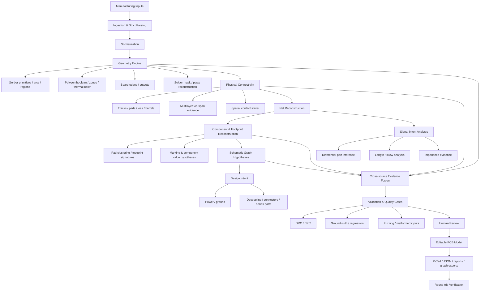

# PHOTONX EDA PCB — Coding Roadmap

This roadmap is intentionally evidence-driven: every inference must preserve uncertainty and provenance.

## Coding priority

1. **Correctness before confidence** — never silently accept unsupported manufacturing syntax.
2. **Physical evidence before semantic inference** — geometry/connectivity are primary.
3. **No invented certainty** — recovered components, values, schematic intent, impedance and net labels remain hypotheses unless directly supported.
4. **Deterministic outputs** — stable IDs, normalized geometry and reproducible exports.
5. **Tests accompany features** — unit, integration, regression, malformed-input, cross-version CI.
6. **Human review stays available** for ambiguous repairs, net merges and component/value inference.

## Current expansion

Implemented in this batch: polygon booleans, mask/paste reconstruction, edge loops, differential-pair candidates, length/skew analysis, impedance evidence, component marking/value inference, schematic graph building, evidence fusion, design-intent helpers and a staged reconstruction pipeline.
