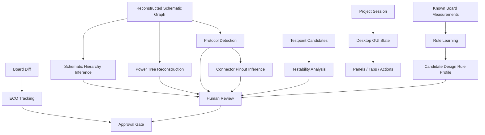

# PHOTONX EDA PCB — Coding Roadmap Phase 10

```mermaid
flowchart TD
    A[Reconstructed Schematic Graph] --> B[Schematic Hierarchy Inference]
    A --> C[Power Tree Reconstruction]
    A --> D[Protocol Detection]
    D --> E[Connector Pinout Inference]
    F[Testpoint Candidates] --> G[Testability Analysis]
    H[Board Diff] --> I[ECO Tracking]
    J[Known Board Measurements] --> K[Rule Learning]
    K --> L[Candidate Design Rule Profile]
    M[Project Session] --> N[Desktop GUI State]
    N --> O[Panels / Tabs / Actions]
    B --> P[Human Review]
    C --> P
    D --> P
    E --> P
    G --> P
    I --> Q[Approval Gate]
    L --> P
    P --> Q
```

Phase 10 adds higher-level design interpretation while keeping every inferred hierarchy, protocol, pin role, rule and ECO reviewable.
