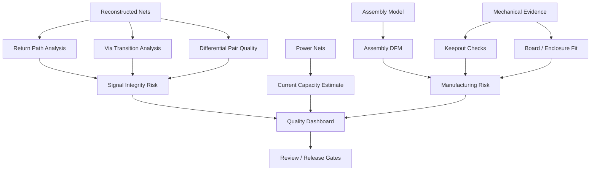

# PHOTONX EDA PCB — Coding Roadmap Phase 11

Phase 11 adds risk-oriented electrical and mechanical analysis. Scores are engineering indicators derived from available evidence; they are not lab measurements or sign-off simulation results.
