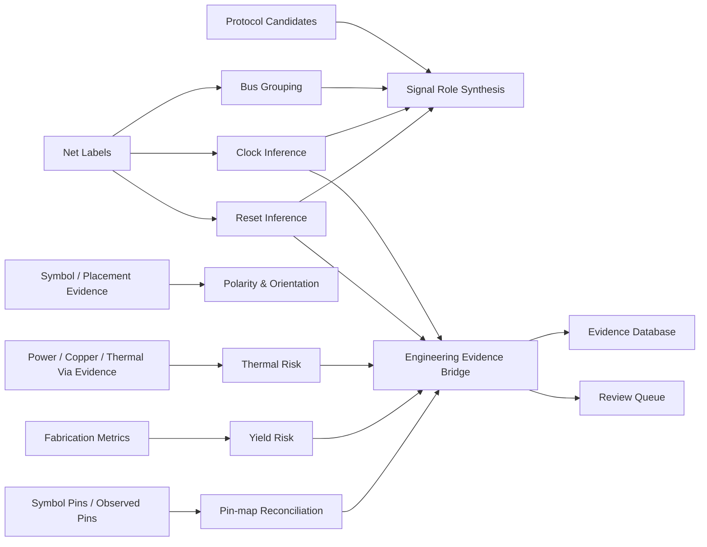

# Phase 11 — Signal Semantics and Engineering Evidence

```mermaid
flowchart LR
  A[Net Labels] --> B[Bus Grouping]
  A --> C[Clock Inference]
  A --> D[Reset Inference]
  E[Protocol Candidates] --> F[Signal Role Synthesis]
  B --> F
  C --> F
  D --> F
  G[Symbol / Placement Evidence] --> H[Polarity & Orientation]
  I[Power / Copper / Thermal Via Evidence] --> J[Thermal Risk]
  K[Fabrication Metrics] --> L[Yield Risk]
  M[Symbol Pins / Observed Pins] --> N[Pin-map Reconciliation]
  C --> O[Engineering Evidence Bridge]
  D --> O
  J --> O
  L --> O
  N --> O
  O --> P[Evidence Database]
  O --> Q[Review Queue]
```

These modules add reviewable evidence. They do not replace timing simulation, thermal simulation, SI/PI analysis, or manufacturer DFM.
