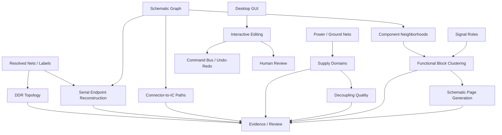

# PHOTONX EDA PCB — Coding Roadmap Phase 12

```mermaid
flowchart TD
  A[Resolved Nets / Labels] --> B[DDR Topology]
  A --> C[Serial Endpoint Reconstruction]
  D[Schematic Graph] --> C
  D --> E[Connector-to-IC Paths]
  F[Power / Ground Nets] --> G[Supply Domains]
  G --> H[Decoupling Quality]
  D --> I[Component Neighborhoods]
  I --> J[Functional Block Clustering]
  K[Signal Roles] --> J
  J --> L[Schematic Page Generation]
  M[Desktop GUI] --> N[Interactive Editing]
  N --> O[Command Bus / Undo-Redo]
  N --> P[Human Review]
  B --> Q[Evidence / Review]
  C --> Q
  E --> Q
  G --> Q
  H --> Q
  J --> Q
  L --> Q
```

Phase 12 connects recovered electrical semantics to navigable functional structure and editable review workflows.
