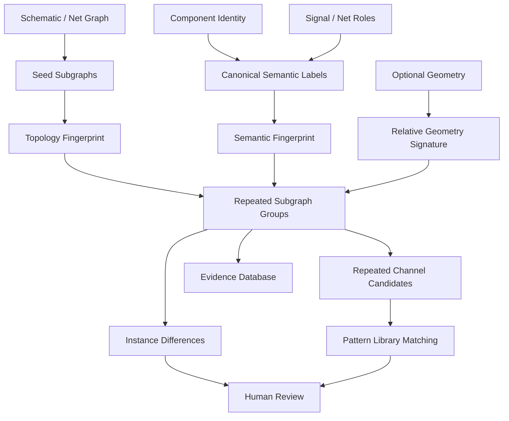

# PHOTONX EDA PCB — Phase 13: Repeated Circuit Reconstruction

Repeated structure is treated as structural evidence only. Similar geometry or topology does not by itself prove identical electrical purpose.
