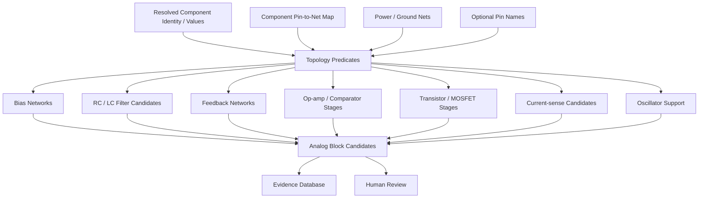

# PHOTONX EDA PCB — Phase 14: Analog Functional Block Inference

No analog function is inferred from physical proximity alone. Connectivity, identity, values, pin roles, and supply evidence drive every candidate.
