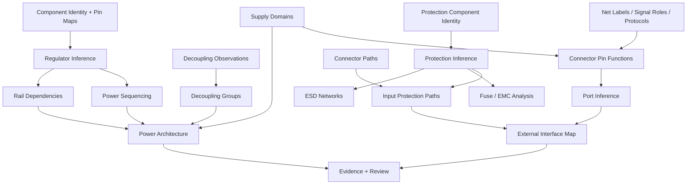

# PHOTONX EDA PCB — Phases 15–17

```mermaid
flowchart TD
  A[Component Identity + Pin Maps] --> B[Regulator Inference]
  C[Supply Domains] --> D[Power Architecture]
  B --> E[Rail Dependencies]
  B --> F[Power Sequencing]
  G[Decoupling Observations] --> H[Decoupling Groups]
  E --> D
  F --> D
  H --> D
  I[Protection Component Identity] --> J[Protection Inference]
  K[Connector Paths] --> L[Input Protection Paths]
  J --> M[ESD Networks]
  J --> N[Fuse / EMC Analysis]
  J --> L
  O[Net Labels / Signal Roles / Protocols] --> P[Connector Pin Functions]
  C --> P
  P --> Q[Port Inference]
  Q --> R[External Interface Map]
  L --> R
  D --> S[Evidence + Review]
  R --> S
```

Power, protection, and connector semantics remain evidence-backed hypotheses unless directly supported by trusted source data.
