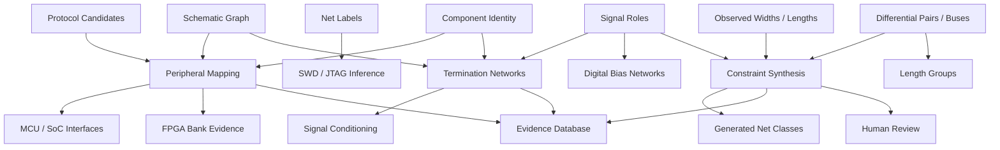

# PHOTONX EDA PCB — Roadmap Phase 18–20

```mermaid
flowchart TD
    A[Protocol Candidates] --> B[Peripheral Mapping]
    C[Schematic Graph] --> B
    D[Component Identity] --> B
    B --> E[MCU / SoC Interfaces]
    B --> F[FPGA Bank Evidence]
    G[Net Labels] --> H[SWD / JTAG Inference]
    I[Signal Roles] --> J[Termination Networks]
    C --> J
    D --> J
    J --> K[Signal Conditioning]
    I --> L[Digital Bias Networks]
    I --> M[Constraint Synthesis]
    N[Observed Widths / Lengths] --> M
    O[Differential Pairs / Buses] --> M
    M --> P[Generated Net Classes]
    O --> Q[Length Groups]
    B --> R[Evidence Database]
    J --> R
    M --> R
    M --> S[Human Review]
```

These phases reconstruct likely interfaces and candidate design constraints. They do not claim firmware pin configuration or original PCB design rules.
