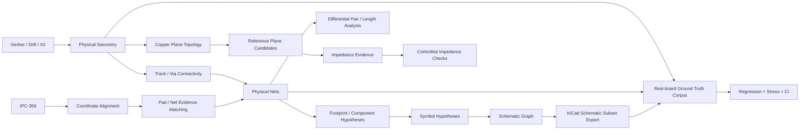

# Coding Roadmap — Electrical Evidence and Schematic Recovery

## Non-negotiable rules
- External evidence never silently overrides physical geometry.
- Unknown values remain unknown.
- Symbol and schematic recovery are hypotheses unless supported by direct source data.
- Every new feature needs deterministic tests and cross-version CI.
