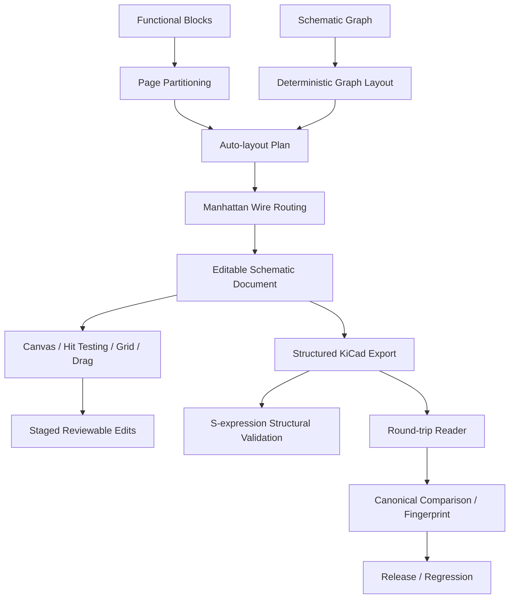

# PHOTONX EDA PCB — Roadmap Phase 21–23

```mermaid
flowchart TD
  A[Functional Blocks] --> B[Page Partitioning]
  C[Schematic Graph] --> D[Deterministic Graph Layout]
  B --> E[Auto-layout Plan]
  D --> E
  E --> F[Manhattan Wire Routing]
  F --> G[Editable Schematic Document]
  G --> H[Canvas / Hit Testing / Grid / Drag]
  H --> I[Staged Reviewable Edits]
  G --> J[Structured KiCad Export]
  J --> K[S-expression Structural Validation]
  J --> L[Round-trip Reader]
  L --> M[Canonical Comparison / Fingerprint]
  M --> N[Release / Regression]
```

Phase 21–23 creates a framework-neutral editable schematic model and deterministic layout/export pipeline.
