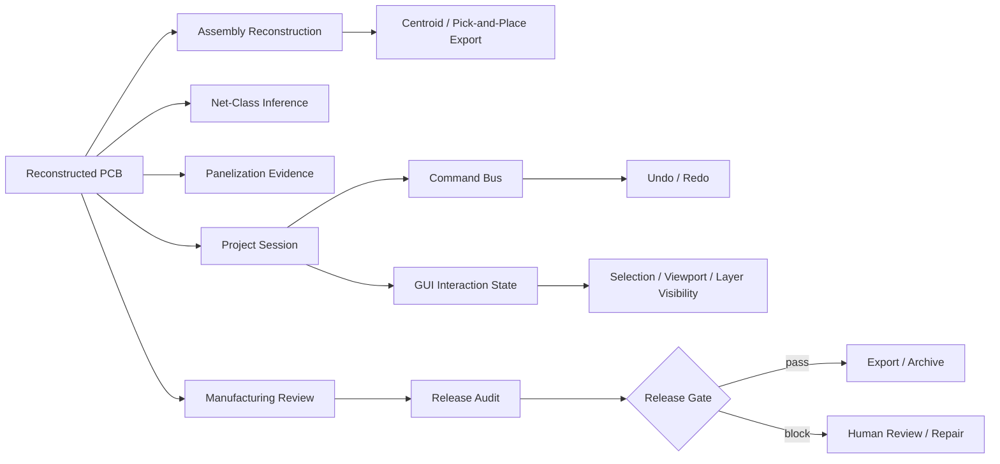

# PHOTONX EDA PCB — Coding Roadmap Phase 4

```mermaid
flowchart LR
    A[Reconstructed PCB] --> B[Assembly Reconstruction]
    B --> C[Centroid / Pick-and-Place Export]
    A --> D[Net-Class Inference]
    A --> E[Panelization Evidence]
    A --> F[Manufacturing Review]
    F --> G[Release Audit]
    A --> H[Project Session]
    H --> I[Command Bus]
    I --> J[Undo / Redo]
    H --> K[GUI Interaction State]
    K --> L[Selection / Viewport / Layer Visibility]
    G --> M{Release Gate}
    M -->|pass| N[Export / Archive]
    M -->|block| O[Human Review / Repair]
```

This phase adds application-level engineering around the reconstruction core. It does not convert heuristic reconstruction into certainty.
