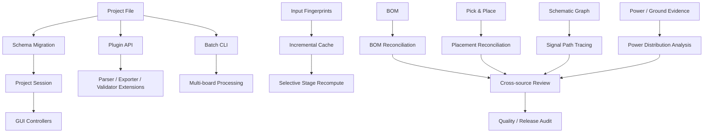

# PHOTONX EDA PCB — Coding Roadmap Phase 5

```mermaid
flowchart TD
    A[Project File] --> B[Schema Migration]
    B --> C[Project Session]
    C --> D[GUI Controllers]
    A --> E[Plugin API]
    E --> F[Parser / Exporter / Validator Extensions]
    A --> G[Batch CLI]
    G --> H[Multi-board Processing]
    I[Schematic Graph] --> J[Signal Path Tracing]
    K[Power / Ground Evidence] --> L[Power Distribution Analysis]
    M[BOM] --> N[BOM Reconciliation]
    O[Pick & Place] --> P[Placement Reconciliation]
    Q[Input Fingerprints] --> R[Incremental Cache]
    R --> S[Selective Stage Recompute]
    N --> T[Cross-source Review]
    P --> T
    J --> T
    L --> T
    T --> U[Quality / Release Audit]
```

Phase 5 focuses on making the reconstruction engine usable as a maintainable application platform rather than only a collection of algorithms.
