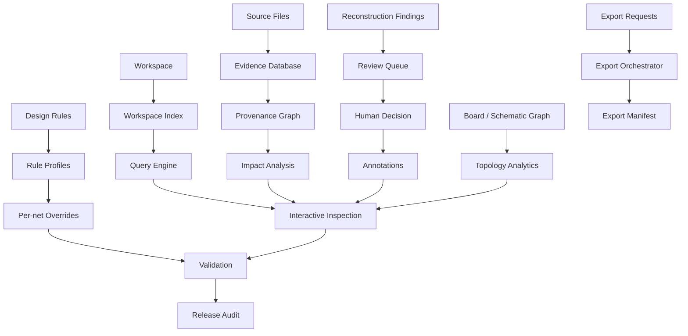

# PHOTONX EDA PCB — Coding Roadmap Phase 6

Phase 6 adds inspectability and reviewability around the reconstruction engine: searchable workspace state, explicit evidence storage, provenance impact tracking and controlled export orchestration.
