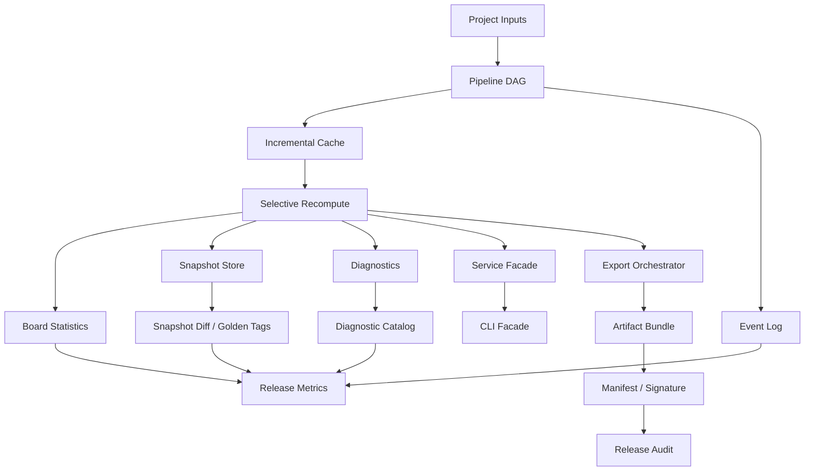

# PHOTONX EDA PCB — Coding Roadmap Phase 7

Phase 7 turns the growing codebase into a reproducible execution platform: dependency-aware stages, immutable state snapshots, structured events, diagnostics and deterministic release bundles.
