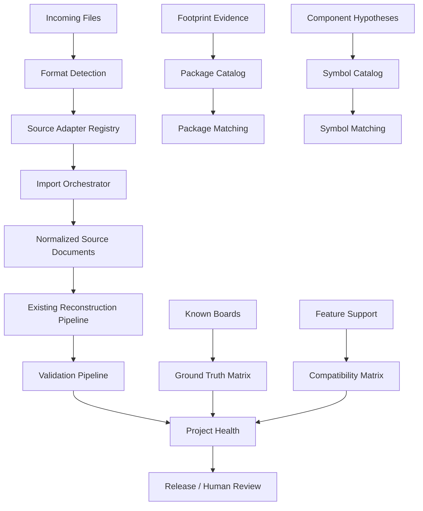

# PHOTONX EDA PCB — Coding Roadmap Phase 8

```mermaid
flowchart TD
    A[Incoming Files] --> B[Format Detection]
    B --> C[Source Adapter Registry]
    C --> D[Import Orchestrator]
    D --> E[Normalized Source Documents]
    E --> F[Existing Reconstruction Pipeline]
    G[Footprint Evidence] --> H[Package Catalog]
    I[Component Hypotheses] --> J[Symbol Catalog]
    H --> K[Package Matching]
    J --> L[Symbol Matching]
    F --> M[Validation Pipeline]
    M --> N[Project Health]
    O[Feature Support] --> P[Compatibility Matrix]
    Q[Known Boards] --> R[Ground Truth Matrix]
    R --> N
    P --> N
    N --> S[Release / Human Review]
```

Phase 8 adds explicit import boundaries and measurable readiness. Unsupported or ambiguous inputs remain visible instead of being silently coerced.
