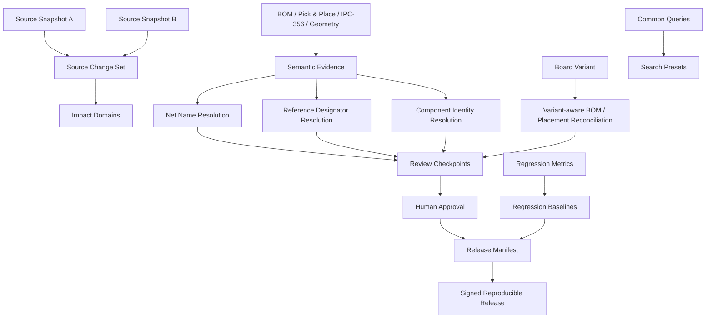

# PHOTONX EDA PCB — Coding Roadmap Phase 9

Phase 9 separates semantic recovery from physical reconstruction. Names, references, identities, values and variants are evidence-backed hypotheses with explicit conflicts.
